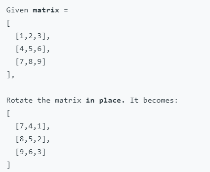
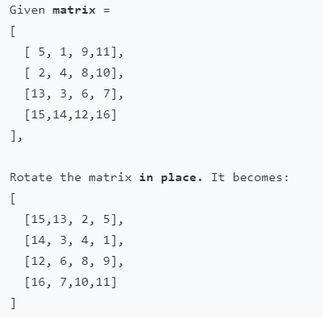

# Question Description:

#### 01.07. Rotate Matrix LCCI

Given an image represented by an N x N matrix, where each pixel in the image is 4 bytes, write a method to rotate the image by 90 degrees. Can you do this in place?

**Example 1:**

**Example 2:**

# Idea:

**C++:**

Flip horizontally first, then flip diagonally. 

# Solution:

**C++:**

`class Solution {`

`public:`

  `void rotate(vector<vector<int>>& matrix) {`

​    `int n = matrix.size();`    

​    `for (int i = 0; i <n/2; i++ )`

​    `{`

​      `for (int j = 0; j< n; j++)`

​      `{`

​        `swap(matrix[i][j],matrix[n-i-1][j]);`

​      `}`

​    `}`

​     `for (int i = 0; i <n; i++ )`

​    `{`

​      `for (int j = i+1; j< n; j++)`

​      `{`

​        `swap(matrix[i][j],matrix[j][i]);`

​      `}`

​    `}`        

  `}`

`};`

