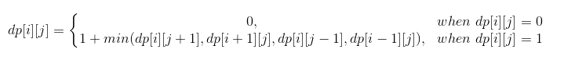

# Question Description:

#### 542. 01 Matrix

Given a matrix consists of 0 and 1, find the distance of the nearest 0 for each cell.  

The distance between two adjacent cells is 1.   

**Example 1:**

Input:  
[[0,0,0],  
 [0,1,0],  
 [0,0,0]]  

Output:  
[[0,0,0],  
 [0,1,0],  
 [0,0,0]]  
**Example 2:** 

Input:  
[[0,0,0],  
 [0,1,0],  
 [1,1,1]]  

Output:  
[[0,0,0],  
 [0,1,0],  
 [1,2,1]]  

**Note:**  

The number of elements of the given matrix will not exceed 10,000.  
There are at least one 0 in the given matrix.  
The cells are adjacent in only four directions: up, down, left and right.  

# Idea:  

**Method 1:**

***Breadth First Search(BFS)*** 

Traverse the matrix to get all 0, and push their index into a queue. Define a vector ***res*** to restore the result, and a vector ***seen*** to record all the visited element;  Always pop the first element of the queue and traverse its surrounding elements, if they are not visited, push it into queue. In this way,  In the first round we get all the element the distance of which from 0 is 1, In the second round is 2, then 3,... so we update the result by adding the last visited element to 1.

**Method 2:**

***Dynamic Programming***

We can see that the distance of every element in the matrix is dependent on its adjacent elements. Every element has four adjacent elements in four direction. In this way we can find its transition equation. It shows in the following. Finally we traverse the matrix twice, separately from top left to bottom right and otherwise.

# Solution:

**Method 1:**

`class Solution {`

`public:`

  `vector<vector<int>> updateMatrix(vector<vector<int>>& matrix) {`  

​    `int rows = matrix.size();`

​    `int cols = matrix[0].size();`

​    `vector<vector<int>> res(rows,vector<int>(cols,0));`

​    `vector<vector<int>> seen(rows,vector<int>(cols,0));`

​    `queue<pair<int,int>> q;`

​    `for(int i = 0; i< rows; i++)`

​    `{`

​      `for(int j = 0; j < cols; j++)`

​      `{`

​        `if(matrix[i][j] == 0)`

​        `{` 

​          `q.push(make_pair(i,j));`

​          `seen[i][j] = 1;`         

​        `}`

​      `}`

​    `}`

​    `while(!q.empty())`

​    `{`

​      `int size = q.size();`      

​      `int dx[4] = {0,1,0,-1};`

​      `int dy[4] = {1,0,-1,0};`

​      `for(int i = 0; i < size; i++)`

​      `{`  

​        `pair<int,int> temp = q.front();`

​        `q.pop();`

​        `int x = temp.first;`

​        `int y = temp.second;`

​        `for(int j = 0; j < 4; j++)`

​        `{`

​          `int newX = x + dx[j];`

​          `int newY = y + dy[j];`

​          `if(newX >= 0 && newX < rows && newY >= 0 && newY < cols && seen[newX][newY] == 0)`           

​          `{`  

​            `res[newX][newY] = res[x][y] + 1;`

​            `seen[newX][newY] = 1;` 

​            `q.push(make_pair(newX,newY));`

​          `}`                  

​        `}`

​      `}`      

​    `}`

​    `return res;`

  `}`

`};`

**Method 2:**

`class Solution {`

`public:`

  `vector<vector<int>> updateMatrix(vector<vector<int>>& matrix) {`

​    `int rows = matrix.size();`

​    `int cols = matrix[0].size();`

​    `vector<vector<int>> dp(rows,vector<int>(cols,0));`

​    `if(rows == 0)`

​     `return matrix;`

​    `for(int i = 0; i < rows; i++)`

​    `{`

​    `for(int j = 0;j < cols;j++)`

​    `{`        

​      `if(matrix[i][j] == 0)`

​        `dp[i][j] = 0;`

​      `else`

​      `{`         

​        `int t_val = (i > 0) ? (dp[i-1][j]+1) : 10000;`

​        `int l_val = (j > 0) ? (dp[i][j-1]+1) : 10000;` 

​        `dp[i][j] = min(t_val,l_val);`

​      `}`

​    `}`      

​    `}`

​    `for(int i = rows-1;i >= 0;i--)`

​    `{`

​      `for(int j = cols-1;j >= 0;j--)`

​      `{`

​        `if(matrix[i][j] == 0)`

​          `dp[i][j] = 0;`

​        `else{`

​        `int d_val = (i < rows-1) ? (dp[i+1][j]+1) : 10000;`

​        `int r_val = (j < cols-1) ? (dp[i][j+1]+1) : 10000;`

​        `dp[i][j] = min(dp[i][j], min(d_val,r_val));`

​        `}`

​      `}`

​    `}`

​    `return dp;`

  `}`

`};`
