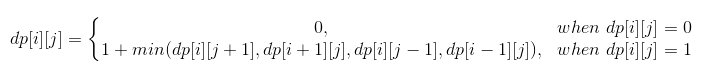

# Question Description:

#### 542. 01 Matrix

Given a matrix consists of 0 and 1, find the distance of the nearest 0 for each cell.  

The distance between two adjacent cells is 1.   

**Example 1:**

Input:  
[[0,0,0],  
 [0,1,0],  
 [0,0,0]]  

Output:  
[[0,0,0],  
 [0,1,0],  
 [0,0,0]]  
**Example 2: ** 

Input:  
[[0,0,0],  
 [0,1,0],  
 [1,1,1]]  

Output:  
[[0,0,0],  
 [0,1,0],  
 [1,2,1]]  

**Note:**  

The number of elements of the given matrix will not exceed 10,000.  
There are at least one 0 in the given matrix.  
The cells are adjacent in only four directions: up, down, left and right.  

# Idea:  

**Dynamic Programming:** 

We can see that the distance of every element in the matrix is dependent on its adjacent elements. Every element has four adjacent elements in four direction. In this way we can find its transition equation. It shows in the following. Finally we traverse the matrix twice, separately from top left to bottom right and otherwise.

# Solution:

`class Solution {`

`public:`

  `vector<vector<int>> updateMatrix(vector<vector<int>>& matrix) {`

​    `int rows = matrix.size();`

​    `int cols = matrix[0].size();`

​    `vector<vector<int>> dp(rows,vector<int>(cols,0));`

​    `if(rows == 0)`

​     `return matrix;`

​    `for(int i = 0; i < rows; i++)`

​    `{`

​    `for(int j = 0;j < cols;j++)`

​    `{`        

​      `if(matrix[i][j] == 0)`

​        `dp[i][j] = 0;`

​      `else`

​      `{`         

​        `int t_val = (i > 0) ? (dp[i-1][j]+1) : 10000;`

​        `int l_val = (j > 0) ? (dp[i][j-1]+1) : 10000;` 

​        `dp[i][j] = min(t_val,l_val);`

​      `}`

​    `}`      

​    `}`

​    `for(int i = rows-1;i >= 0;i--)`

​    `{`

​      `for(int j = cols-1;j >= 0;j--)`

​      `{`

​        `if(matrix[i][j] == 0)`

​          `dp[i][j] = 0;`

​        `else{`

​        `int d_val = (i < rows-1) ? (dp[i+1][j]+1) : 10000;`

​        `int r_val = (j < cols-1) ? (dp[i][j+1]+1) : 10000;`

​        `dp[i][j] = min(dp[i][j], min(d_val,r_val));`

​        `}`

​      `}`

​    `}`

​    `return dp;`

  `}`

`};`