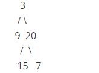

# Question Description:

#### 102. Binary Tree Level Order Traversal

Given a binary tree, return the level order traversal of its nodes' values. (ie, from left to right, level by level).

For example:
Given binary tree [3,9,20,null,null,15,7],

return its level order traversal as:
[
  [3],
  [9,20],
  [15,7]
]

# Idea:

Define a queue, by using its character of FIFO, we push a node, pop it, and then push its left node and right node until queue becomes empty. In order to store it in a two dimension vector, the size of queue is calculated, by traversing the queue according its size, we store it into a  one dimension vector,then put the one dimension vector into two dimension vector.  

# Solution:

`/**`

 `\* Definition for a binary tree node.`

 `\* struct TreeNode {`

 `\*   int val;`

 `\*   TreeNode *left;`

 `\*   TreeNode *right;`

 `\*   TreeNode(int x) : val(x), left(NULL), right(NULL) {}`

 `\* };`

 `*/`

`class Solution {`

`public:`

  `vector<vector<int>> levelOrder(TreeNode* root) {`    

​    `vector<vector<int>> v;`

​    `if(root == NULL) return v;`

​    `queue<TreeNode*> q;`

​    `q.push(root);`

​    `while(!q.empty())`

​    `{`

​     `int l = q.size();` 

​     `vector<int> ve;`   

​     `for(int i = 0; i < l; i++)`

​     `{`        

​       `root = q.front();`

​       `ve.push_back(root -> val);`

​       `q.pop();`

​       `if(root -> left)`

​        `q.push(root ->left);` 

​       `if(root -> right)`

​        `q.push(root -> right);`

​     `}`

​     `v.push_back(ve);`            

​    `}`

​    `return v;`

  `}`

`};`