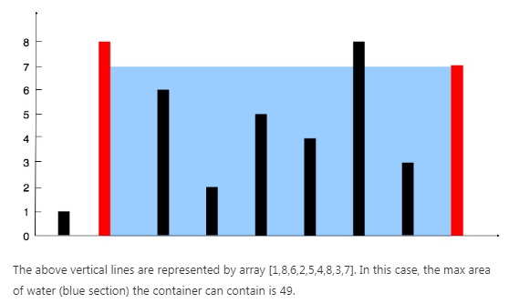

# Question Description:

#### 11. Container With Most Water

Given n non-negative integers a1, a2, ..., an , where each represents a point at coordinate (i, ai). n vertical lines are drawn such that the two endpoints of line i is at (i, ai) and (i, 0). Find two lines, which together with x-axis forms a container, such that the container contains the most water.

Note: You may not slant the container and n is at least 2.



**Example:**

```
Input: [1,8,6,2,5,4,8,3,7]
Output: 49
```

# Idea:

Two pointers: define two pointers, one points to the rightmost vertical line, one points to the leftmost vertical line, compare the two lines and move the shorter one for one step, at the same time record every container area after moving and compare it with the previous most area and leave the larger one.

# Solution:

**C++:**

`class Solution {`

`public:`

  `int maxArea(vector<int>& height) {`

​    `int maxAre = 0;`

​    `int l = 0;`

​    `int r = height.size() -1;`

​    `while(l < r)`

​    `{`

​      `int Area = (r - l) * min(height[r],height[l]);`

​      `maxAre = max(maxAre, Area);`

​      `if(height[l] < height[r])`

​       `l++;`

​      `else`

​       `r--;`

​    `}`

​    `return maxAre;`

  `}`

`};`