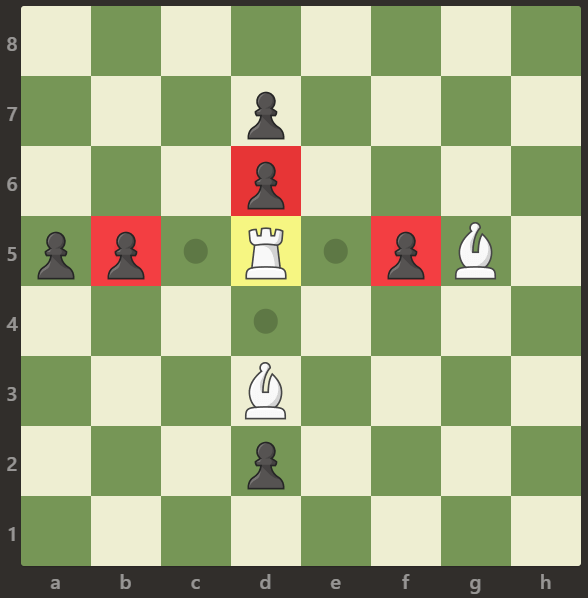

# Question Description:

#### 999. Available Captures for Rook

On an 8 x 8 chessboard, there is one white rook.  There also may be empty squares, white bishops, and black pawns.  These are given as characters 'R', '.', 'B', and 'p' respectively. Uppercase characters represent white pieces, and lowercase characters represent black pieces.

The rook moves as in the rules of Chess: it chooses one of four cardinal directions (north, east, west, and south), then moves in that direction until it chooses to stop, reaches the edge of the board, or captures an opposite colored pawn by moving to the same square it occupies.  Also, rooks cannot move into the same square as other friendly bishops.

Return the number of pawns the rook can capture in one move.

**Example 1:**

Input: [[".",".",".",".",".",".",".","."],[".",".",".","p",".",".",".","."],[".",".",".","R",".",".",".","p"],[".",".",".",".",".",".",".","."],[".",".",".",".",".",".",".","."],[".",".",".","p",".",".",".","."],[".",".",".",".",".",".",".","."],[".",".",".",".",".",".",".","."]]
Output: 3
Explanation: 
In this example the rook is able to capture all the pawns.

**Example 2:**

Input: [[".",".",".",".",".",".",".","."],[".","p","p","p","p","p",".","."],[".","p","p","B","p","p",".","."],[".","p","B","R","B","p",".","."],[".","p","p","B","p","p",".","."],[".","p","p","p","p","p",".","."],[".",".",".",".",".",".",".","."],[".",".",".",".",".",".",".","."]]
Output: 0
Explanation: 
Bishops are blocking the rook to capture any pawn.

**Example 3:**

Input: [[".",".",".",".",".",".",".","."],[".",".",".","p",".",".",".","."],[".",".",".","p",".",".",".","."],["p","p",".","R",".","p","B","."],[".",".",".",".",".",".",".","."],[".",".",".","B",".",".",".","."],[".",".",".","p",".",".",".","."],[".",".",".",".",".",".",".","."]]
Output: 3
Explanation: 
The rook can capture the pawns at positions b5, d6 and f5.

# Idea:

1. Traverse the vector board to find the coordinate(x, y) of the white rook;
2. Define two arrays dx, dy to represent the increment when the rook moves every step in a direction. Then combine steps to simulate the movement of the rook in every direction.  

# Solution:

`class Solution {`

`public:`

  `int numRookCaptures(vector<vector<char>>& board) {`

​    `int cnt = 0;` 

​    `int x = 0;`

​    `int y = 0;`

​    `int dx[4]={-1,0,1,0};`

​    `int dy[4]={0,-1,0,1};`

​    `for(int i = 0; i < 8; i++)`

​    `{`

​      `for(int j = 0; j < 8; j++ )`

​      `{`

​        `if( board[i][j] == 'R')`

​        `{`

​          `x=i;`

​          `y=j;`

​          `break;`

​        `}`

​      `}`

​    `}`

​      `for(int i = 0; i < 4; i++)`

​     `{`

​       `for(int step = 1; ; step++ )`

​       `{`

​        `int tx= x + step*dx[i];`

​        `int ty= y + step*dy[i];`

​        `if(tx <0 || tx>=8 || ty<0 || ty>=8 || board[tx][ty]=='B')`

​          `break;`

​         `if(board[tx][ty]=='p')`

​        `{`

​          `cnt++;`

​          `break;`

​        `}`       

​       `}`

​     `}`    

​    `return cnt;`

  `}`

`};`